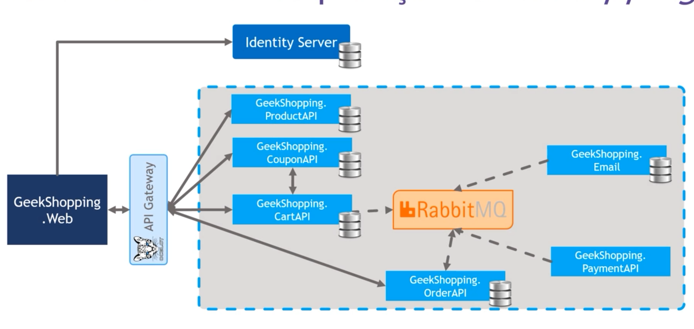

# example-microservico
Exemplo de aplicação com micro serviço utilizando: ASP.NET .NET 'Core' 6

## Diagrama
<h1 align="center">
  
</h1>

### Algumas tecnologias utilizadas:

* ASP.NET;
* .NET 6;
* Oauth2;
* OpenID;
* JWT (JSON Web Tokens);
* Identity Server;
* RabbitMQ;
* API Gateway com Ocelot
* Linq
* Duende IdentityServer
* AutoMapper
* Pomelo
